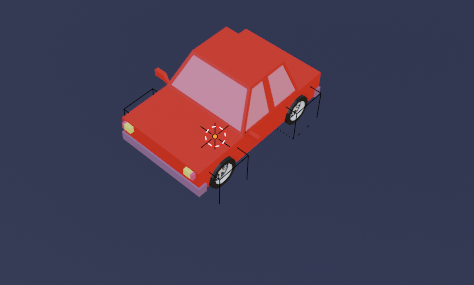
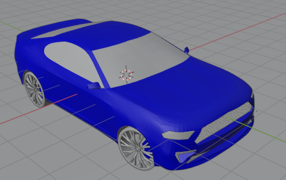

# Automotive simulation using OpenGL python
This repository is for a Graphics course final project. The project is to develop an Automotive simulation using OpenGl. Car Folder contains blend, obj and material files of our first blender trial car. The ziped folder contains a 3d car model downloaded from some website. (free3d.com)
## Screenshot of the car folder blender object 

## Screenshot of the car we downloaded from free3d.com

## important youtube linkes that helps us to load the blender files into our opengl project.
https://www.youtube.com/watch?v=DKt4HRBqH1I&list=PL1P11yPQAo7opIg8r-4BMfh1Z_dCOfI0y&index=15

https://www.youtube.com/watch?v=zi8-XFTR-Sc

|   Team             | ID          |
|:------------------:|:-----------:|
| Tesfaye Adugna     |UGR/4709/12  |
| Kenna Tefera       |UGR/0713/12  |
