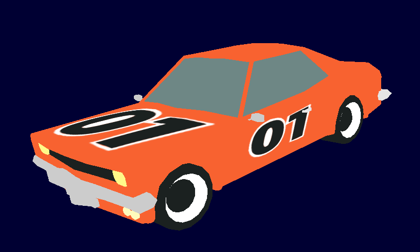
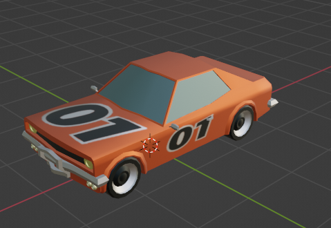

# Automotive simulation using OpenGL python
This repository is for a Graphics course final project. The project is to develop an Automotive simulation using OpenGl. The Finalized project is in the Final folder above. The Trial folder contains other folders we have been trying on. There are photos and codes. It shows how the project built from first trying it to generate the points on our own to developing it in blender and loading the object file.
## Here is The final Output.

## Here is The final project car developed in Blender.

## Screenshot of the car folder blender object. we built this car while learning blender for the first time. 

## Screenshot of the car we downloaded from free3d.com

## important youtube linkes that helps us to load the blender files into our opengl project.
https://www.youtube.com/watch?v=DKt4HRBqH1I&list=PL1P11yPQAo7opIg8r-4BMfh1Z_dCOfI0y&index=15

https://www.youtube.com/watch?v=zi8-XFTR-Sc

|   Team             | ID          |
|:------------------:|:-----------:|
| Tesfaye Adugna     |UGR/4709/12  |
| Kenna Tefera       |UGR/0713/12  |
